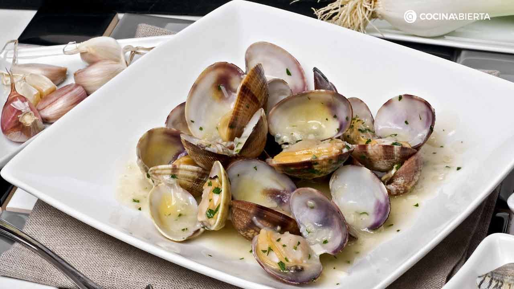

El título es algo impreciso porque hay mil formas de preparar las almejas a la marinera, aunque seguro que ninguna decepciona. En Cantabria, como en todo el litoral del norte, tienen almejas de gran calidad y saben cocinarlas como nadie, sin tener que complicarse demasiado la receta.

Ingredientes para 4 personas:

|Ingredientes          | Cantidad              |
|--------------------- | --------------------- |
|Almejas               |         600g          |
|Cebolla               |          1/2          |
|Diente de ajo         |           1           |
|Guindilla             |          1/2          |
|Harina de trigo       |          20 g         |
|Pimentón dulce        |          10 g         |
|Tomate frito casero   |          15 mL        |
|Vino de Jerez         |         100 mL        |
|Laurel                |           1           |
|Perejil fresco        |        Al gusto       |
|Aceite de oliva virgen extra|  Al gusto       |

### Elaboración:

Dificultad: Fácil

Tiempo total: 20m

Cocción: 20m

Dejamos las almejas en remojo durante 2 horas al menos, en una cacerola con agua abundante y una cuchara de sal gorda para que las almejas suelten la arena que puedan tener. Es conveniente cambiar el agua cada media hora. A continuación, abrimos las almejas, poniéndolas al vapor sobre una cazuela con un vaso de agua, una cucharadita de sal gruesa y una hoja de laurel. Según se vayan abriendo, retiramos las almejas y las reservamos. Si no tenéis un utensilio para cocer al vapor, podéis usar una cacerola que tenga tapa y un colador grande que pueda contener las almejas. En una sartén vamos haciendo el sofrito, pochando a fuego lento en aceite de oliva virgen extra la media cebolla, la guindilla y el diente de ajo muy muy picados, hasta que prácticamente se deshagan. Añadimos el pimentón y la harina y removemos rápidamente haciendo una pasta o roux. Seguidamente, incorporamos el vino de Jerez y removemos hasta que evapore su alcohol. A continuación añadimos el tomate frito y el agua de haber abierto las almejas que habremos colado previamente. Probamos y rectificamos de sal. Dejamos que se reduzca durante unos 5 minutos y metemos en la sartén las almejas que teníamos abiertas y reservadas. Dejamos otros 3 ó 4 minutos hasta que la salsa alcance el punto de espesor que nos guste y apagamos el fuego.

